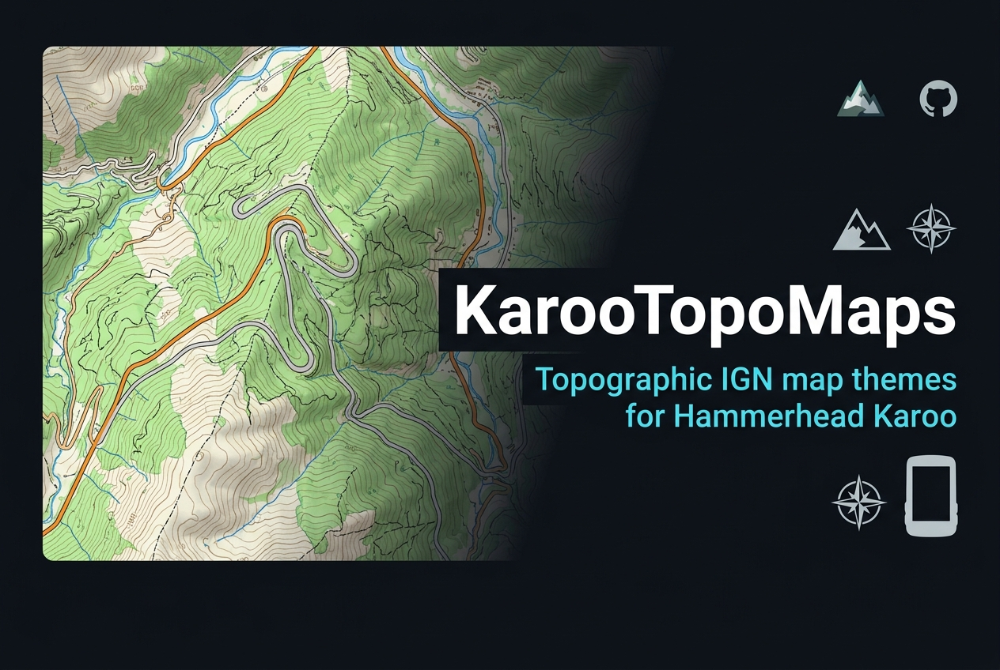

# 🗺️ KarooTopoMaps

> Topographic map themes for **Hammerhead Karoo** devices | [🇪🇸 Español](README.md)

<p align="center">
  
</p>

---

## 🌍 What is this?

This repository contains cartographic rendering themes that transform your Karoo's standard map into high-quality topographic maps, similar to those of Spain's **National Geographic Institute (IGN)** and other national topographic mapping agencies.

> ⚠️ **Important:** These themes modify the visual appearance of the map, not the data sources. Karoo will still use its own OpenStreetMap data, but rendered with topographic IGN-style visuals.

---

## 🎨 Available Themes

| Theme | Description | Country |
|---|---|---|
| `IGN-España` | Spanish IGN topographic style. Contour lines, hillshading, hypsometric colors | 🇪🇸 Spain |
| `IGN-Ciclismo` | Cycling-optimized variant. Higher gradient contrast, highlighted roads | 🇪🇸 Spain |

---

## 📦 Installation

There are **two methods** to install:

---

### Method 1 — Via ADB (Recommended ⭐)

The fastest method. You just need Android Debug Bridge (ADB) installed on your PC.

**Step 1.** Connect your Karoo via USB and enable ADB debugging:
> On your Karoo: **Settings → System → About device** → tap 7 times on "Build number" → go back to **Settings → Developer options → USB Debugging: ON**

**Step 2.** Download the theme file you want from the [`themes/`](themes/) folder

**Step 3.** Run on your PC:

```bash
adb push themes/IGN-España.xml /sdcard/osmand/rendering/IGN-España.xml
```

**Step 4.** On your Karoo, open **OsmAnd → Configure map → Map style** and select `IGN-España`.

---

### Method 2 — Via USB cable (MTP)

If you don't have ADB, you can copy the file manually:

**Step 1.** Connect Karoo to PC with USB cable and choose **"File Transfer (MTP)"**

**Step 2.** Navigate to:
```
Karoo → Internal Storage → osmand → rendering
```

**Step 3.** Copy the `.xml` theme file into that folder

**Step 4.** On your Karoo: **OsmAnd → Configure map → Map style** → select the theme

---

## 🔧 Script Installation (Windows)

If you have ADB and want to install all themes at once:

```powershell
.\scripts\install_themes.ps1
```

---

## 📚 Resources

- [OsmAnd rendering style documentation](https://osmand.net/docs/technical/osmand-file-formats/osmand-rendering-style)
- [OsmAnd community styles repository](https://github.com/osmandapp/OsmAnd-resources)
- [ALTGRAPH — 3D Altimetry extension for Karoo](https://github.com/DAVOE75/ALTGRAPH)

---

## 📄 License

MIT License — David García Pascual (hesiOX) 2026
---

## ☕ Support the project

If you find these maps useful and would like to support their maintenance:

<div align="center">
  <a href="https://buymeacoffee.com/hesiox" target="_blank">
    
  </a>
</div>
